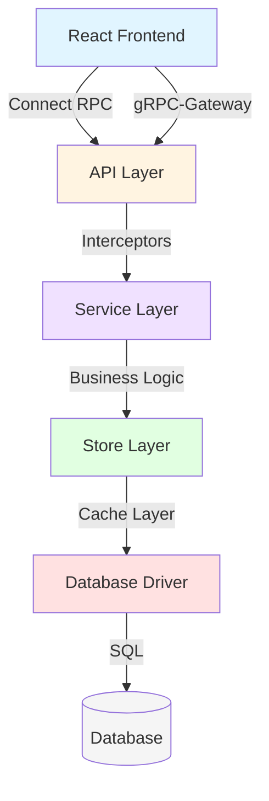
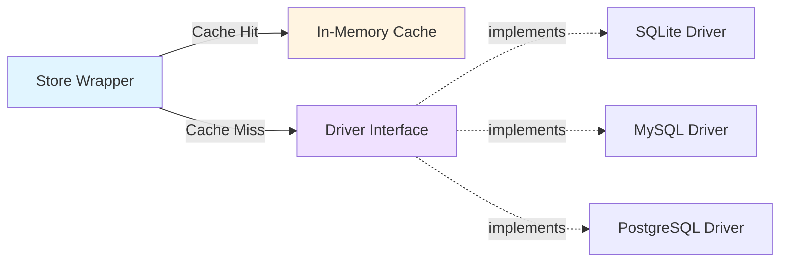
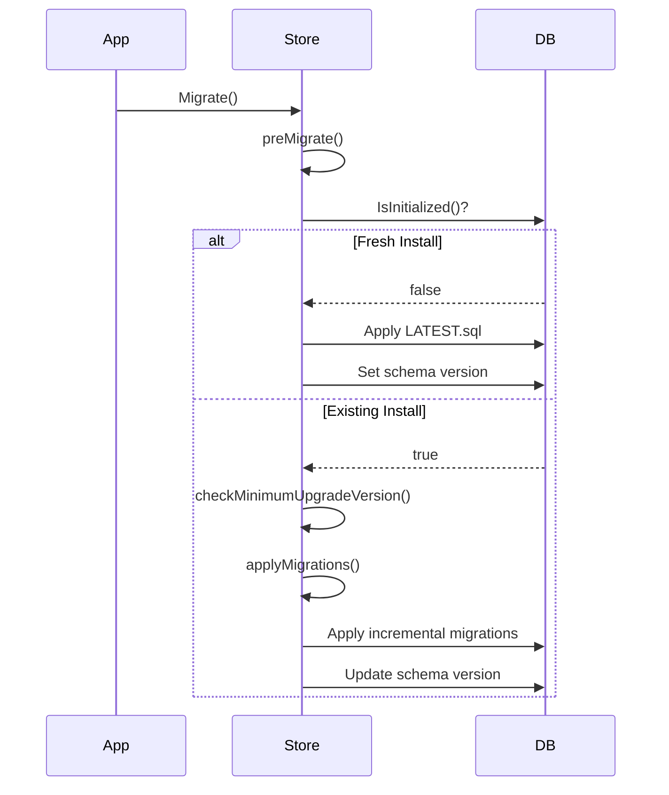
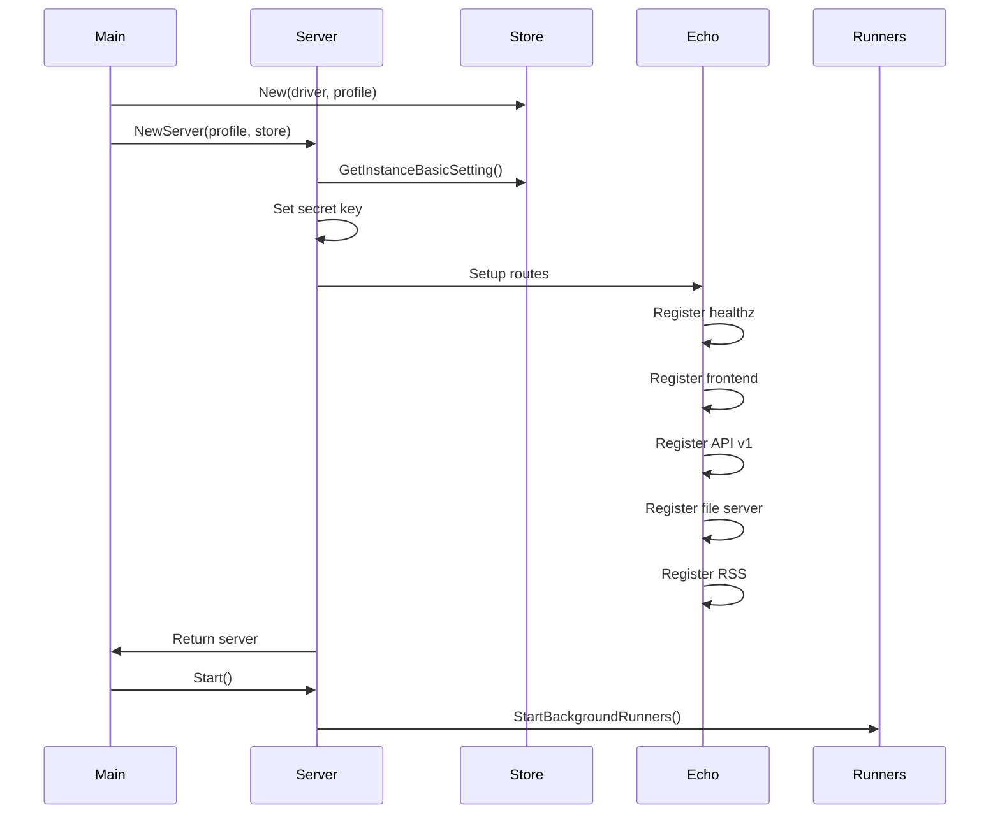

## Overview

Memos is built as a modern full-stack application with a clean separation between frontend and backend, using protocol buffers for type-safe API contracts.



## Technology Stack

### Backend
- **Language**: Go 1.25+
- **API Protocol**: gRPC + Connect RPC
- **Web Framework**: Echo v5 (HTTP router)
- **Databases**: SQLite (default), MySQL, PostgreSQL
- **Schema**: Protocol Buffers v2 with buf code generation

### Frontend
- **Framework**: React 18.3 with TypeScript
- **Build Tool**: Vite 7
- **State Management**: React Query v5 + React Context
- **Styling**: Tailwind CSS v4
- **API Client**: Connect RPC

## Architecture Layers

### 1. API Layer: Dual Protocol Design

Memos implements a dual-protocol API layer that serves both browser clients and external tools:

#### Connect RPC (Browser Clients)

```
Base Path: /memos.api.v1.*
Protocol: connectrpc.com/connect
Content-Type: application/json
```

**Interceptor Chain** (server/router/api/v1/connect_interceptors.go:177-227):
1. **Metadata Interceptor**: Extracts client metadata
2. **Logging Interceptor**: Request/response logging
3. **Recovery Interceptor**: Panic recovery
4. **Auth Interceptor**: Authentication validation

```go
// Interceptor chain example
interceptors := connect.WithInterceptors(
    NewMetadataInterceptor(),
    NewLoggingInterceptor(),
    NewRecoveryInterceptor(),
    NewAuthInterceptor(store, secret),
)
```

#### gRPC-Gateway (REST API)

```
Base Path: /api/v1/*
Protocol: HTTP/JSON
```

Provides REST-compatible endpoints for external tools, CLI clients, and integrations. Uses the same service implementations as Connect RPC.

See: server/router/api/v1/v1.go:52-96

### 2. Authentication System

Memos implements a three-tier authentication system:

#### JWT Access Tokens (Stateless)
- **Lifetime**: 15 minutes
- **Storage**: Memory (client-side)
- **Validation**: Signature verification only
- **Use Case**: Active user sessions

```go
// Token structure
type AccessTokenClaims struct {
    Type     string // "access"
    Role     string // User role
    Status   string // User status
    Username string // Username for display
    jwt.RegisteredClaims
}
```

**Algorithm**: HS256 (HMAC-SHA256)  
**Secret**: Auto-generated on first run (server/server.go:53-57)

See: server/auth/token.go:133-160

#### JWT Refresh Tokens (Stateful)
- **Lifetime**: 30 days
- **Storage**: HTTP-only cookie
- **Validation**: Database lookup (revocation check)
- **Use Case**: Session persistence

See: server/auth/authenticator.go:60-99

#### Personal Access Tokens (Long-lived)
- **Format**: `memos_pat_<random32chars>`
- **Storage**: SHA-256 hash in database
- **Validation**: Database lookup + expiry check
- **Use Case**: API integrations, automation

```go
// PAT generation
func GeneratePersonalAccessToken() string {
    randomStr, _ := util.RandomString(32)
    return PersonalAccessTokenPrefix + randomStr
}

// PAT storage (hashed)
func HashPersonalAccessToken(token string) string {
    hash := sha256.Sum256([]byte(token))
    return hex.EncodeToString(hash[:])
}
```

See: server/auth/token.go:189-203

**Authentication Priority** (server/auth/authenticator.go:167-199):
1. Bearer token (Access Token V2)
2. Bearer token (PAT)
3. Refresh token cookie (fallback)

### 3. Store Layer: Driver Pattern

The store layer abstracts database operations through a clean interface pattern:



#### Driver Interface

```go
type Driver interface {
    GetDB() *sql.DB
    Close() error
    IsInitialized(ctx context.Context) (bool, error)
    
    CreateMemo(ctx context.Context, create *Memo) (*Memo, error)
    ListMemos(ctx context.Context, find *FindMemo) ([]*Memo, error)
    UpdateMemo(ctx context.Context, update *UpdateMemo) error
    DeleteMemo(ctx context.Context, delete *DeleteMemo) error
    // ... similar methods for all resources
}
```

See: store/driver.go:8-71

#### Database Implementations

| Driver | Package | Connection |
|--------|---------|------------|
| SQLite | `modernc.org/sqlite` | File-based, WAL mode |
| MySQL | `go-sql-driver/mysql` | TCP connection |
| PostgreSQL | `lib/pq` | TCP connection |

**SQLite Configuration** (store/db/sqlite/sqlite.go:49):
```go
DSN + "?_pragma=foreign_keys(0)" +
      "&_pragma=busy_timeout(10000)" +
      "&_pragma=journal_mode(WAL)" +
      "&_pragma=mmap_size(0)"
```

### 4. Caching Strategy

The Store wrapper maintains in-memory caches for frequently accessed data:

```go
type Store struct {
    driver  Driver
    profile *profile.Profile
    
    // Cache settings
    cacheConfig cache.Config
    
    // Caches
    instanceSettingCache *cache.Cache
    userCache            *cache.Cache
    userSettingCache     *cache.Cache
}
```

**Cache Configuration** (store/store.go:27-32):
- **Default TTL**: 10 minutes
- **Cleanup Interval**: 5 minutes
- **Max Items**: 1000
- **Eviction Policy**: LRU (Least Recently Used)

**Cached Resources**:
- Instance settings (global configuration)
- Users (authentication lookups)
- User settings (preferences)

See: store/store.go:10-57

### 5. Frontend State Management

#### React Query v5 (Server State)

All API interactions use React Query for automatic caching, background refetching, and optimistic updates:

```typescript
// Query configuration
const queryClient = new QueryClient({
  defaultOptions: {
    queries: {
      staleTime: 30_000,        // 30 seconds
      gcTime: 5 * 60 * 1000,    // 5 minutes
      refetchOnWindowFocus: true,
      refetchOnReconnect: true,
    },
  },
});
```

**Query Key Organization**:
```typescript
const memoKeys = {
  all: ['memos'] as const,
  lists: () => [...memoKeys.all, 'list'] as const,
  list: (filter: string) => [...memoKeys.lists(), filter] as const,
  details: () => [...memoKeys.all, 'detail'] as const,
  detail: (id: string) => [...memoKeys.details(), id] as const,
};
```

See: web/src/lib/query-client.ts

#### React Context (Client State)

| Context | Purpose | State |
|---------|---------|-------|
| `AuthContext` | Authentication | Current user, auth status |
| `ViewContext` | UI preferences | Layout mode, sort order |
| `MemoFilterContext` | Filtering | Active filters, shortcuts |

See: web/src/contexts/

### 6. Database Migration System

Memos uses a version-based migration system with transactional safety:

#### Migration Flow



#### Schema Versioning

**Version Format**: `major.minor.patch` (e.g., `0.28.5`)  
**Storage**: `system_setting` table, key `BASIC`, field `schema_version`

**Migration Files**:
```
store/migration/
├── sqlite/
│   ├── LATEST.sql           # Full schema for new installs
│   ├── 0.27/
│   │   ├── 01__add_uid.sql
│   │   └── 02__add_payload.sql
│   └── 0.28/
│       └── 01__add_parent_uid.sql
├── mysql/
│   └── ...
└── postgres/
    └── ...
```

See: store/migrator.go:21-414

#### Migration Safety

- **Transactional**: All migrations in single transaction
- **Ordered**: Lexicographic ordering by filename
- **Idempotent**: Checks current version before applying
- **Downgrade Protection**: Rejects schema version downgrades
- **Minimum Version**: Requires v0.22+ to upgrade (store/migrator.go:365-405)

### 7. Protocol Buffer Code Generation

Memos uses Protocol Buffers for type-safe API contracts:

```bash
# Regenerate code from .proto files
cd proto && buf generate
```

**Generated Outputs**:
- **Go**: `proto/gen/api/v1/` (backend services)
- **TypeScript**: `web/src/types/proto/api/v1/` (frontend)

**Buf Configuration** (proto/buf.yaml):
- Lint rules: BASIC
- Breaking change detection: FILE

## Plugin System

Memos supports pluggable components for extended functionality:

| Plugin | Purpose | Location |
|--------|---------|----------|
| `scheduler` | Cron job scheduling | plugin/scheduler/ |
| `email` | SMTP email delivery | plugin/email/ |
| `filter` | CEL expression filtering | plugin/filter/ |
| `webhook` | HTTP webhook dispatch | plugin/webhook/ |
| `markdown` | Markdown parsing (goldmark) | plugin/markdown/ |
| `httpgetter` | HTTP content fetching | plugin/httpgetter/ |
| `storage/s3` | S3-compatible storage | plugin/storage/s3/ |

## Background Runners

Background jobs run in separate goroutines with cancellation support:

```go
func (s *Server) StartBackgroundRunners(ctx context.Context) {
    s3Context, s3Cancel := context.WithCancel(ctx)
    s.runnerCancelFuncs = append(s.runnerCancelFuncs, s3Cancel)
    
    s3presignRunner := s3presign.NewRunner(s.Store)
    s3presignRunner.RunOnce(ctx)  // Initial run
    
    go func() {
        s3presignRunner.Run(s3Context)  // Continuous run
    }()
}
```

**Active Runners**:
- **S3 Presign Runner**: Generates presigned URLs for S3 objects (server/runner/s3presign/)

See: server/server.go:144-164

## Server Initialization



See: server/server.go:38-88

## File Structure

```
memos/
├── cmd/memos/              # Entry point
│   └── main.go
├── server/                 # HTTP server & API
│   ├── server.go          # Server initialization
│   ├── auth/              # Authentication logic
│   ├── router/
│   │   ├── api/v1/        # gRPC/Connect services
│   │   ├── frontend/      # Static file serving
│   │   ├── fileserver/    # Media file serving
│   │   └── rss/           # RSS feed generation
│   └── runner/            # Background jobs
├── store/                  # Data layer
│   ├── store.go           # Store wrapper with cache
│   ├── driver.go          # Database interface
│   ├── cache.go           # Cache implementation
│   ├── migrator.go        # Migration system
│   ├── db/
│   │   ├── sqlite/        # SQLite driver
│   │   ├── mysql/         # MySQL driver
│   │   └── postgres/      # PostgreSQL driver
│   └── migration/         # SQL migration files
├── proto/                  # Protocol Buffer definitions
│   ├── api/v1/            # API service definitions
│   └── gen/               # Generated code
├── web/                    # React frontend
│   ├── src/
│   │   ├── components/    # React components
│   │   ├── contexts/      # React Context
│   │   ├── hooks/         # React Query hooks
│   │   ├── lib/           # Utilities
│   │   └── pages/         # Page components
│   └── vite.config.mts
└── plugin/                 # Backend plugins
```

## Next Steps

<CardGroup cols={2}>
  <Card title="Backup & Restore" icon="database" href="/advanced/backup-and-restore">
    Learn how to backup and restore your Memos data
  </Card>
  <Card title="Security" icon="shield" href="/advanced/security">
    Security best practices and hardening
  </Card>
  <Card title="Performance Tuning" icon="gauge" href="/advanced/performance-tuning">
    Optimize Memos for production workloads
  </Card>
  <Card title="API Reference" icon="code" href="/api/introduction">
    Complete API documentation
  </Card>
</CardGroup>